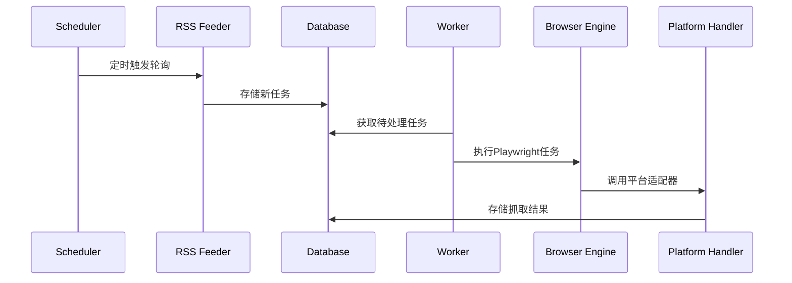

# 抓取类

1. 激活浏览器实例

2. 从接口获取任务类型

3. 根据任务类型调用代码

# 任务分为

- twittwer

    - 媒体页

        - 点击图片解析直链下载，直到图片id已经在数据库中存在

- 微博

    - 媒体页

        - 点击图片解析直链下载，直到图片id已经在数据库中存在

bilibili

    - [√] 媒体页

        - 点击图片解析直链下载，直到图片id已经在数据库中存在

    - 动态页

        - 拉取动态，图片使用远程链接和文本一同保存为字符串

    - 直播api

        查看开播状态

- pixiv

    - 进入更新页面

        查看从第一个开始获取缩略图，直到时间戳早于上次运行

# 建议的设计策略

RSS 用作「任务发现器」：

定时轮询 RSS → 获取新内容 ID → 存入数据库或任务队列

Playwright 作为「执行器」：

对于需要交互、鉴权、动态加载的任务仍用 Playwright

「RSS 任务发现 + Playwright 执行」组合结构示例包括：

1. 任务注册机制

2. RSS 增量判断

3. 抓取策略分离（如下载器模块）


根据您的需求，我将设计一个结合RSS任务发现和Playwright执行的抓取系统，无需强制部署RSSHub（但可作为选项）。以下是优化后的架构设计：

### 系统架构图
```
+---------------------+
|    任务调度中心       |
| (Task Scheduler)    |
+----------+----------+
           |
           | 分发任务
+----------v----------+    +-------------------+
|   RSS任务发现器      |    |   数据库          |
| (RSS Feeder)       +---->| (Task Queue DB)  |
+----------+----------+    +---------+---------+
           |                         |
           | 发现新内容               | 获取待处理任务
+----------v----------+    +---------v---------+
| Playwright执行引擎  |<---+  任务执行队列      |
| (Browser Engine)   |    | (Task Queue)      |
+----------+----------+    +-------------------+
           |
           | 执行平台特定操作
+----------v------------------------+
|          平台适配层                |
| (Platform Adapters)               |
|   - Twitter媒体页处理器            |
|   - 微博媒体页处理器               |
|   - B站媒体/动态/直播处理器        |
|   - Pixiv更新处理器               |
+-----------------------------------+
```

### 核心模块实现

#### 1. 任务注册机制 (task_registry.py)
```python
PLATFORM_HANDLERS = {
    "twitter_media": TwitterMediaHandler,
    "weibo_media": WeiboMediaHandler,
    "bilibili_media": BilibiliMediaHandler,
    "bilibili_dynamic": BilibiliDynamicHandler,
    "bilibili_live": BilibiliLiveHandler,
    "pixiv_updates": PixivUpdateHandler
}

def register_task(task_type, params):
    # 将任务存入数据库并标记状态为PENDING
    db.insert_task({
        "task_id": generate_uuid(),
        "type": task_type,
        "params": params,  # 包含内容ID/URL
        "status": "PENDING",
        "created_at": datetime.now()
    })
```

#### 2. RSS增量发现器 (rss_feeder.py)
```python
def poll_rss_feeds():
    # 配置源示例（支持原生RSS和RSSHub）
    feeds = [
        {"platform": "twitter", "url": "https://rsshub.app/twitter/user/abc"},
        {"platform": "bilibili", "url": "https://space.bilibili.com/123/rss"}
    ]
    
    for feed in feeds:
        try:
            data = feedparser.parse(feed['url'])
            for entry in data.entries:
                # 提取内容唯一ID（平台特定逻辑）
                content_id = extract_content_id(entry.link, feed['platform']) 
                
                if not db.content_exists(feed['platform'], content_id):
                    register_task(
                        task_type=f"{feed['platform']}_media",
                        params={"url": entry.link, "content_id": content_id}
                    )
        except Exception as e:
            logging.error(f"RSS poll failed: {feed['url']} - {str(e)}")
```

#### 3. Playwright执行引擎 (browser_engine.py)
```python
async def run_task(task):
    browser = await chromium.launch(headless=True)
    context = await browser.new_context()
    
    try:
        handler_class = PLATFORM_HANDLERS[task['type']]
        handler = handler_class(context, task)
        await handler.execute()
        db.mark_task_completed(task['task_id'])
    except Exception as e:
        db.mark_task_failed(task['task_id'], str(e))
    finally:
        await context.close()
        await browser.close()
```

### 平台适配层示例

#### Twitter媒体处理器 (twitter_handler.py)
```python
class TwitterMediaHandler:
    def __init__(self, context, task):
        self.context = context
        self.task = task
    
    async def execute(self):
        page = await self.context.new_page()
        await page.goto(self.task['params']['url'])
        
        while True:
            # 图片解析逻辑
            image_elements = await page.query_selector_all("div[data-testid='image'] img")
            for img in image_elements:
                src = await img.get_attribute("src")
                image_id = src.split("/")[-1].split("?")[0]
                
                if db.image_exists("twitter", image_id):
                    return  # 终止条件
                
                # 下载并存储
                await download_image(src, image_id)
                db.store_image_meta("twitter", image_id, self.task['params']['url'])
            
            # 翻页逻辑
            next_btn = await page.query_selector("div[aria-label='下一张']")
            if next_btn:
                await next_btn.click()
                await page.wait_for_timeout(2000)
```

#### B站动态处理器 (bilibili_dynamic_handler.py)
```python
class BilibiliDynamicHandler:
    async def execute(self):
        # 使用API直接获取动态
        api_url = f"https://api.bilibili.com/x/polymer/web-dynamic/v1/detail?host_mid={self.task['params']['mid']}"
        response = requests.get(api_url)
        
        for item in response.json()['data']['items']:
            content = item['modules']['module_dynamic']['desc']['text']
            images = []
            
            # 提取图片直链
            for pic in item['modules']['module_dynamic']['major']['draw']['pics']:
                images.append(pic['url'])
            
            db.store_dynamic({
                "dynamic_id": item['id_str'],
                "content": content,
                "images": json.dumps(images),
                "timestamp": item['modules']['module_author']['pub_ts']
            })
```

### 部署建议

1. **RSS源选择**：
   - 优先使用平台原生RSS（如B站提供官方RSS）
   - 无原生RSS时可选方案：
     ```python
     # 方案1：使用公共RSSHub实例（无需自部署）
     "https://rsshub.app/twitter/user/abc"
     
     # 方案2：自建RSSHub（推荐用于生产环境）
     "http://your-rsshub-instance/twitter/user/abc"
     ```

2. **增量控制**：
   ```python
   # 在Pixiv处理器中实现时间戳终止条件
   last_run = db.get_last_run_time("pixiv")
   while current_item_time > last_run:
       # 处理当前项
       # 滚动加载下一页
   ```

3. **性能优化**：
   - 使用Playwright持久化Context保存登录态
   - 为各平台配置独立请求队列
   - 设置任务优先级（如直播监控>媒体下载）

### 执行流程


此设计实现了：
1. 任务发现与执行分离
2. 支持混合抓取策略（RSS+直接爬取）
3. 平台无关的处理框架
4. 增量抓取控制
5. 故障恢复机制（通过任务状态标记）

您可以根据实际需求选择是否部署RSSHub。对于微博等反爬严格的平台，建议配合使用Playwright模拟登录+代理IP轮换方案。